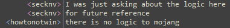

# Naschkatze
A Minecraft Mod  

#### Requires Forge 12.18.1.2011+  

Work in progress!
Ditched the copper & coil stuff to start with a uranium processing related mod!

### Special Thanks
This mod would not be possible without the patitence and constant assistance of many people from the #minecraftforge IRC.  
Here are named some to whom I owe most of my current understanding of forge, minecraft source code and modding in general:  
diesieben07  
gigaherz  
howtonotwin  
williewillus  
Ordinastie_  
  
  
  
#### IRC best moments
```
<Ordinastie_> because to be honest, you clearly lack programming knowledge to do something better optimised  
  
<diesieben07> do you know what the word "instance" means?  
  
<RANKSHANK> probably the first thing you should learn is how to use your ide  
  
<diesieben07> jesus man, use your IDE  
  
<ghz|afk> keep in mind scanning for entities is slow  
<ghz|afk> so you may want to throttle it a bit  
<secknv> so what is the best of knowing when a player is within 3 blocks of my block  
<ghz|afk> williewillus told you  
<ghz|afk> there's methods in world, for scanning  
<secknv> but you said it's slow  
<ghz|afk> yes  
<secknv> slow is not best :\  
<ghz|afk> but you have limited java knowledge  
<secknv> i cry  
```

